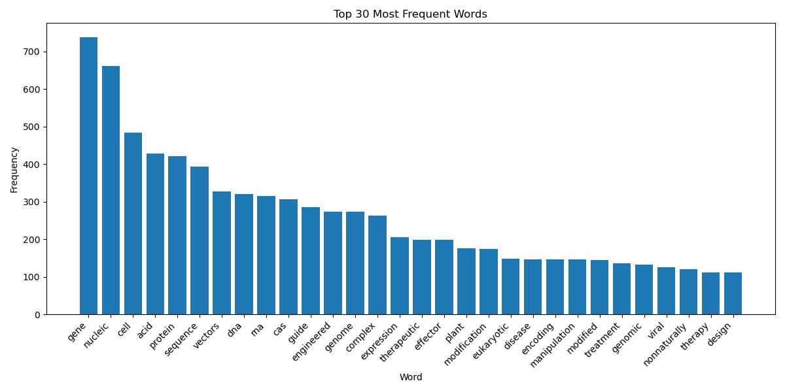

# CRISPR Patent Text Analysis

This is a small text analysis project focused on identifying the most frequent and meaningful terms in patent abstracts and titles related to CRISPR technology.

The project cleans and preprocesses the text data, removes common stopwords and uninformative terms, and finally visualizes the top 30 most frequent words using a bar chart.

---

## 🧪 Project Purpose

The goal of this project is to:

- Combine title and abstract information from CRISPR-related patents.
- Preprocess the text (lowercasing, removing punctuation, filtering stopwords).
- Extract and visualize frequently used terms after cleaning.
- Understand key vocabulary and trends in CRISPR patent literature.

---

## 📁 Dataset

The data used in this project was manually gathered from Lens.org by searching for CRISPR-related patents focusing on delivery systems, within the years 2020 to 2024.

Rather than downloading a complete dataset or using an API, a selection of patent records was curated based on perceived relevance and significance. The extracted data includes the following fields:

Lens ID

Publication Date

Title

Abstract

These fields were stored in a CSV file named crispr_patents.csv, which serves as the input for the analysis.

---

## 📦 Requirements

This project uses the following Python libraries:

- `pandas`
- `collections.Counter`
- `matplotlib`

You can install the dependencies using:

```bash
pip install -r requirements.txt
```

---

## 🚀 How to Run

```bash
python crispr_text_analysis.py
```

The script will output the most common cleaned words in the terminal and display a bar chart of the top 30 terms.

---

## 📄 License

This project is shared for educational and non-commercial purposes.\
Please respect the license of the original dataset if you use it further.

---

## 📊 Results

A bar chart showing the top 30 most frequent and meaningful words is saved and/or displayed at the end of the script. You can find the resulting visualization in the results/ folder:


---

## 🤝 Contributions

This is a learning project. Contributions and suggestions are welcome!

